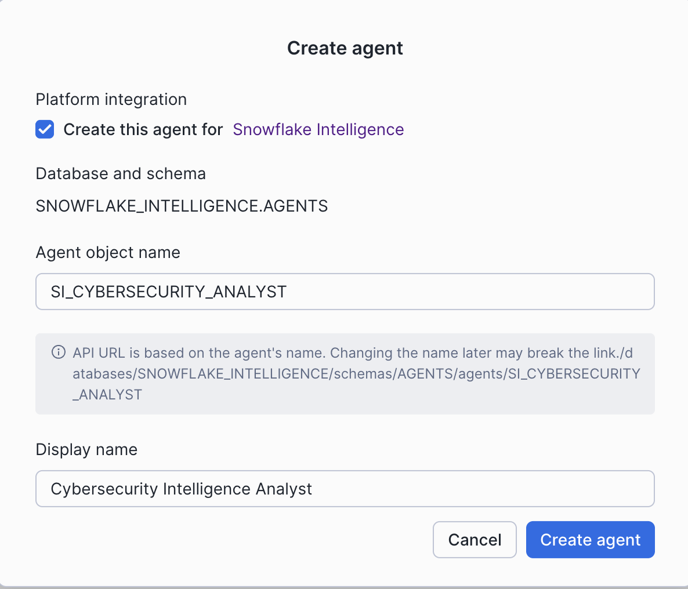
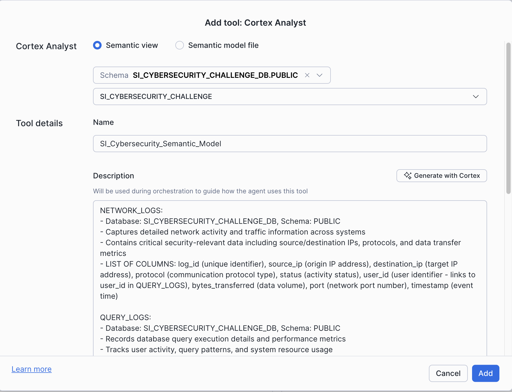

# Snowflake Intelligence CTF - Cybersecurity Challenge

A Capture The Flag (CTF) challenge that demonstrates Snowflake's Intelligence capabilities using cybersecurity log analysis with Cortex Agents and Semantic Models.

## Challenge 1
Someone is trying to exfiltate data from a Snowflake account. However they are trying to avoid detection. Use Snowflake inteligence to uncover evidence. The flag will be obvious and have a format like ctf{FLAG}


## Deployment Steps


### Prerequisites
Before deploying this challenge, ensure you have:

1. **Snowflake Account** with access to:
   - ACCOUNTADMIN role (or equivalent privileges)
   - Snowflake Cortex features enabled
   - Snowflake Intelligence enabled

2. **Enable Snowflake Intelligence**:
   - Follow the instructions in the [Snowflake Intelligence documentation](https://docs.snowflake.com/en/user-guide/snowflake-cortex/snowflake-intelligence) to enable this feature in your account
   - This is required for creating Cortex Agents


### Step 1: Run the Setup Script

1. Open Snowsight (https://app.snowflake.com)
2. Navigate to **Projects** > **Worksheets**
3. Create a new SQL worksheet
4. Copy the entire contents of `setup_snowflake.sql` from this repository
5. Paste it into the worksheet
6. Click **Run All** to execute the script

[Screenshot: Snowsight worksheet with setup_snowflake.sql]

The script will automatically:
- Create the `SI_CYBERSECURITY_DB` database
- Create the `SI_CYBERSECURITY_WH` warehouse
- Create `NETWORK_LOGS` and `QUERY_LOGS` tables
- Load sample data from GitHub
- Create a semantic model named `SI_CYBERSECURITY`

**Expected Output**: The script should complete successfully with messages confirming data load and semantic model creation.

## Create the Cortex Agent

Now that your data and semantic model are set up, create a Cortex Agent to enable natural language queries.

### Step 1: Navigate to Agents

1. In Snowsight, go to **AI & ML** > **Agents**
2. Click **+ Create agent**


### Step 2: Configure Basic Settings

1. Select the following options:
   - **Platform integration**: Leave the box for **"Create this agent for Snowflake Intelligence"** checked
   - **Agent object name**: `SI_CYBERSECURITY_ANALYST`
   - **Display name**: `Snowflake Intelligence Challenge Agent`

2. Click **Create agent**




### Step 3: Edit Agent Configuration

After creation, open the agent and press the "edit" button

#### About -> Description
```
An AI agent for analyzing cybersecurity logs including network traffic and query patterns. 
Use this agent to investigate security incidents, identify anomalies, and analyze user behavior.
```

#### Orchestration -> Orchestration instructions

```
You are a cybersecurity analyst assistant specializing in log analysis. 

Your role is to:
- Analyze network logs and query logs to identify patterns and anomalies
- Help users understand security-related metrics and trends
- Provide clear, actionable insights about potential security issues
- Explain findings in a professional yet accessible manner

#### Orchestration -> Response instructions

When answering questions:
- Be specific and cite the data sources
- Highlight unusual patterns or outliers
- Suggest follow-up questions when relevant
- Prioritize security-critical information
```

### Step 4: Add Cortex Analyst Tool

1. Scroll to the **Tools** section
2. Click **+ Add** next to  **Cortex Analyst** 

3. Configure the Cortex Analyst tool:
   - **Schema**: `SI_CYBERSECURITY_DB.PUBLIC`
   - **Semantic view**: Select `SI_CYBERSECURITY` from the dropdown
   - **Name**: `SI_Cybersecurity_Semantic_Model`
   - Leave the rest of the options as default
4. Generate the description with cortex
5. Click **Add** to save the tool




### Step 5: Save and Test

1. Click **Save** in the top right corner to save all agent configurations
2. Test the agent by asking one of the sample questions in the chat interface
3. Verify that the agent responds with data from your semantic model

### Step 6: Access the Agent

1. Go to [ai.snowflake.com](https://ai.snowflake.com)
2. Click on "Agents" in the left navigation menu
3. Find and select your newly created cybersecurity agent from the list
4. The agent is now ready to analyze your security logs and answer questions

## License
Copyright (c) Snowflake Inc. All rights reserved.
Licensed under the Apache 2.0 license.
